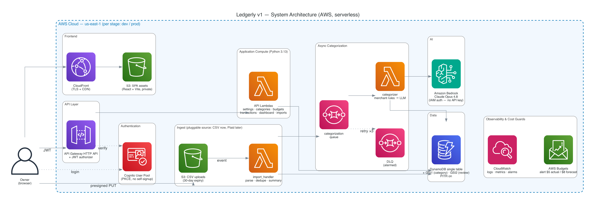

# Ledgerly — Architecture Document

**Version:** 1.2
**Status:** Approved (owner review 2026-07-13; rendered diagram added per review feedback)
**Last updated:** 2026-07-13

> Owns **HOW** (system design) and **WHERE** (§0.1 deployment target & environment). Every
> significant choice recorded here has a matching ADR in `ledgerly-adl.md`
> that owns the **WHY**. If this doc and the plan doc ever disagree on design, this doc wins.

---

## 0. Overview

Ledgerly is a small, fully serverless web application with one important asymmetry: the
**write path is a pipeline** and the **read path is a dashboard**. Bank-export CSVs are
uploaded to S3, parsed and idempotently persisted to DynamoDB by a Lambda, and then
categorized *asynchronously* — an SQS queue feeds a categorizer Lambda that first applies
owner-taught merchant rules and only then calls Claude (Opus 4.8 via Amazon Bedrock) with
structured output. The dashboard reads are two DynamoDB queries per budget cycle (budgets +
date-ranged transactions) aggregated in a Lambda.

The single most important architectural idea: **everything is keyed by user and budget
cycle.** Every item lives under a `USER#<sub>` partition (multi-tenant-ready from day one),
and transactions sort by date so that any budget cycle — calendar month or two-week
anchored — is a contiguous key range. "Budget vs. actual for this cycle" is therefore a
key-range query, not a scan or a join.

Major moving parts: a React SPA (S3 + CloudFront) → Cognito (auth) → API Gateway HTTP API
(JWT authorizer) → Python Lambdas → DynamoDB single table, plus the S3-triggered import
Lambda, the SQS-fed categorizer Lambda, and Bedrock. There are **no runtime secrets
anywhere**: Bedrock, DynamoDB, S3, and SQS are all reached with IAM roles.

### 0.1 Deployment target & environment — the WHERE

- **Target:** AWS, single-cloud, serverless-first (ADR-001).
- **Why this target:** near-zero idle cost fits the $10/month ceiling (NFR-1.1); the owner
  has the most access/familiarity on AWS; AWS serverless + IaC is a primary learning goal.
  See ADR-001.
- **Chosen stack** (each anchored to an ADR):
  | Layer | Choice | ADR |
  |---|---|---|
  | Compute | AWS Lambda, Python 3.13 | ADR-002 |
  | Frontend | React + Vite + TypeScript SPA on S3 + CloudFront | ADR-003 |
  | IaC / deploy | AWS CDK (Python) → CloudFormation | ADR-004 |
  | Data | DynamoDB single table, on-demand | ADR-005 |
  | Identity | Amazon Cognito User Pool + API Gateway JWT authorizer | ADR-006/007 |
  | AI | Claude Opus 4.8 via Amazon Bedrock | ADR-008 |
  | Async | SQS + DLQ | ADR-009 |
  | API front door | API Gateway **HTTP API** (cheaper/simpler than REST API; JWT authorizer built in) | §1.2 |
- **Runtime environments:** one AWS account, two CDK-parameterized stages — `dev` (working
  stage, every slice deploys here first) and `prod` (the owner's real instance, promoted
  once a slice is verified). Both are near-zero idle cost, so running two stages does not
  threaten the ceiling. Region: `us-east-1` (Bedrock model availability + CloudFront cert
  simplicity).
- **Portability posture:** business logic (cycle math, CSV normalization, categorization
  prompting/parsing) lives in plain Python modules with no AWS imports; Lambda handlers,
  the `Categorizer` interface (ADR-008), and the repository layer are the seams. No active
  multi-cloud abstraction is built (ADR-001 trade-off); §1.4 records conceptual parallels.

---

## 1. System Architecture

### 1.1 Diagram

**Rendered diagram (canonical for human review):**
[`ledgerly-architecture-diagram.png`](./ledgerly-architecture-diagram.png) ·
[`ledgerly-architecture-diagram.pdf`](./ledgerly-architecture-diagram.pdf)

The diagram is **code**: [`render_architecture.py`](./render_architecture.py) (mingrammer
`diagrams` + graphviz) regenerates both files — install/run instructions are in the
script header. Diagram-as-code is the project convention: whenever this section changes,
update the script and re-render in the same commit, so the picture can never drift from
the doc.



**ASCII sketch** (text-searchable quick reference for coding sessions; the rendered
diagram above is authoritative if they ever disagree):

```
                       ┌────────────────────────── AWS (one account, per stage) ─────────────────────────┐
                       │                                                                                  │
 Owner's browser       │   ┌──────────────┐      ┌─────────────────────┐                                 │
 ┌────────────┐  HTTPS │   │  CloudFront  │──────│  S3 (SPA assets)    │                                 │
 │ React SPA  │◄───────┼──►│  (CDN, TLS)  │      └─────────────────────┘                                 │
 └─────┬──────┘        │   └──────────────┘                                                              │
       │ login (OIDC + PKCE)                                                                             │
       ▼               │   ┌──────────────┐                                                              │
 ┌────────────┐        │   │   Cognito    │  JWT                                                         │
 │ Hosted UI  │◄───────┼──►│  User Pool   │───┐                                                          │
 └────────────┘        │   └──────────────┘   │                                                          │
       │ Bearer JWT    │                      ▼                                                          │
       │               │   ┌─────────────────────────┐     ┌──────────────────────────────┐             │
       └───────────────┼──►│ API Gateway (HTTP API)  │────►│  API Lambdas (Python 3.13)   │             │
                       │   │  + JWT authorizer       │     │  categories / budgets /      │             │
                       │   └───────────┬─────────────┘     │  transactions / dashboard /  │             │
                       │               │ presigned URL     │  imports / settings          │             │
                       │               ▼                   └───────┬──────────────────────┘             │
                       │   ┌─────────────────────┐                 │                                    │
                       │   │ S3 (csv uploads)    │                 ▼                                    │
                       │   └─────────┬───────────┘         ┌──────────────────┐                         │
                       │             │ S3 event            │  DynamoDB        │                         │
                       │             ▼                     │  single table    │◄───────────┐            │
                       │   ┌─────────────────────┐  write  │  + GSI1 + GSI2   │            │            │
                       │   │  Import Lambda      │────────►│  (PITR on)       │            │            │
                       │   │  parse · dedupe ·   │         └──────────────────┘            │            │
                       │   │  import summary     │                                         │ write      │
                       │   └─────────┬───────────┘                                         │            │
                       │             │ enqueue jobs                                        │            │
                       │             ▼                                                     │            │
                       │   ┌─────────────────────┐  batch   ┌───────────────────────┐     │            │
                       │   │  SQS queue ── DLQ   │─────────►│  Categorizer Lambda   │─────┘            │
                       │   └─────────────────────┘          │  rules → Claude       │                   │
                       │                                    └──────────┬────────────┘                   │
                       │                                               │ IAM (no API key)               │
                       │                                               ▼                                │
                       │                                    ┌───────────────────────┐                   │
                       │                                    │  Amazon Bedrock       │                   │
                       │                                    │  Claude Opus 4.8      │                   │
                       │                                    └───────────────────────┘                   │
                       │                                                                                 │
                       │   CloudWatch (logs · metrics · alarms)      AWS Budgets (billing alarm < $10)   │
                       └─────────────────────────────────────────────────────────────────────────────────┘
```

### 1.2 Rationale by layer

- **Frontend** — static React + Vite + TS SPA on S3/CloudFront (ADR-003). No SSR: the app
  is fully authenticated, so there is nothing to index. CloudFront gives TLS + caching for
  pennies.
- **Auth** — Cognito User Pool, self-signup disabled, one admin-created user (ADR-007).
  The SPA uses Authorization Code + PKCE against the hosted UI. API Gateway's **JWT
  authorizer** validates tokens *before* Lambda runs, so FR-1.1 (no anonymous surface) is
  enforced at the front door, not in application code.
- **API** — API Gateway **HTTP API** rather than REST API: ~70% cheaper per request,
  simpler, and its built-in JWT authorizer is exactly the integration Cognito needs. The
  API is a small REST-ish surface (see §2.5 for routes); each route group maps to one
  Lambda to keep functions small without exploding their count.
- **Compute** — Python 3.13 Lambdas (ADR-002), thin handlers over plain-Python domain
  modules (`core/`), a shared repository layer for DynamoDB access.
- **Data** — one DynamoDB table, access-pattern-first (ADR-005, §2). PITR on; deletion
  protection on in `prod`.
- **Ingest** — CSV upload via **presigned S3 URL** (the API hands the browser a URL; the
  file never transits Lambda), S3 event triggers the import Lambda. This is the pluggable
  seam FR-2.3 requires: a future Plaid source is just another producer that writes
  transactions and enqueues categorization jobs — everything downstream is unchanged.
- **AI** — `Categorizer` interface → merchant rules → Claude Opus 4.8 on Bedrock with
  structured output (ADR-008). IAM-authenticated; no secrets.
- **Async** — SQS + DLQ between import and categorization (ADR-009). FR-3.5 holds by
  construction: transactions are durably persisted *before* any categorization is
  attempted, so the worst categorization failure leaves an `Uncategorized` transaction,
  never a lost one.

### 1.3 What's deliberately not in v1 (and the trigger to add it)

| Not built | Trigger to add |
|---|---|
| EventBridge event bus | First second subscriber (alerts, trends, recurring detection) — ADR-009 records this |
| Plaid ingest source | v1 success criterion 1 met + owner appetite to revise cost ceiling (ADR required, NFR-1.1) |
| Custom domain / Route53 | Owner wants a memorable URL; CloudFront default domain is fine to start |
| Pre-aggregated cycle summary items | Dashboard aggregation in Lambda exceeds ~2s (NFR-2.1) — not plausible at hundreds of tx/cycle |
| Caching layer (DAX / CloudFront API caching) | Measured latency problem, none expected |
| Multi-region / DR beyond PITR | Never for a single-user app; PITR + IaC re-deploy is the recovery story |
| WAF | Public-facing multi-user surface (post-v1 product pivot) |
| Step Functions | A pipeline stage needs orchestration beyond queue → worker (e.g. Plaid backfill) |

### 1.4 Cross-cloud parallels (learning aid)

| Ledgerly (AWS) | Azure | GCP |
|---|---|---|
| Lambda | Functions | Cloud Functions / Cloud Run |
| API Gateway HTTP API | API Management | API Gateway |
| DynamoDB | Cosmos DB | Firestore / Bigtable |
| Cognito | Entra External ID | Identity Platform |
| S3 + CloudFront | Blob Storage + Front Door | GCS + Cloud CDN |
| SQS | Storage Queues / Service Bus | Pub/Sub (pull) |
| Bedrock | Azure AI Foundry (Claude available) | Vertex AI (Claude available) |
| CDK | Bicep / azd | — (Terraform typical) |
| CloudWatch | Monitor | Cloud Monitoring |

---

## 2. Data Model

### 2.1 Methodology — access-pattern-first

Enumerate every read/write the product actually performs (from FRs), then design keys so
each is a `GetItem`/`Query`/conditional `PutItem` — never a scan. The two shaping facts:

1. **Budgets are per budget cycle** (FR-4.2/4.3) — monthly *or* two-week anchored — so
   "cycle" must be a first-class key component, not a calendar-month convention.
2. **Everything is user-scoped** (FR-1.3, ADR-006) — every PK starts `USER#<sub>`.

**Cycle ID convention.** A cycle is identified by cadence + start date:
`M#2026-07` (calendar month) or `B#2026-07-10` (two-week cycle starting 2026-07-10).
Cycle IDs are computed from the settings item (never stored as authoritative state on
transactions — a transaction stores its date; the cycle window is derived). This means a
cadence change (effective next cycle, FR-4.2) never rewrites historical items.

### 2.2 Access patterns

| # | Access pattern | R/W | Serving construct |
|---|---|---|---|
| 1 | Get owner settings (cadence config, anchor) | R | GetItem `PROFILE` |
| 2 | List categories (active + archived) | R | Query `begins_with(SK, CAT#)` |
| 3 | Create / rename / archive category | W | PutItem / UpdateItem `CAT#` |
| 4 | Get budgets for a cycle (dashboard) | R | Query `begins_with(SK, BUDGET#<cycleId>#)` |
| 5 | Set budget amount for category + cycle | W | PutItem `BUDGET#<cycleId>#<catId>` |
| 6 | Get transactions in a date window (cycle dashboard, list view) | R | Query `SK between TXN#<start> and TXN#<end>` |
| 7 | Idempotent transaction insert (dedupe re-uploads) | W | PutItem `TXN#…` with `attribute_not_exists(SK)` |
| 8 | Get transactions by category (+ date window) — drill-down | R | GSI1 Query |
| 9 | Review queue: low-confidence transactions | R | GSI2 Query (sparse) |
| 10 | Re-categorize a transaction (correction) | W | UpdateItem `TXN#…` (sets GSI1 key, clears GSI2 key) |
| 11 | Record import summary; list recent imports | R/W | PutItem / Query `begins_with(SK, IMPORT#)` |
| 12 | Skip an already-imported file (file-level dedupe) | W | PutItem `FILEHASH#<sha256>` conditional |
| 13 | Look up merchant rule for a normalized merchant | R | GetItem `RULE#<merchant>` |
| 14 | Upsert merchant rule on correction | W | PutItem `RULE#<merchant>` |
| 15 | List past cycles for the cycle picker | R | Computed from settings + first-transaction date (no table access beyond #1) |
| 16 | Text/amount filtering of transactions (FR-6.1) | R | Pattern #6 + FilterExpression (bounded: one cycle ≈ hundreds of items) |

### 2.3 Entity model

```
User (Cognito sub) 1 ──── 1 Settings
                   1 ──── * Category ──── * Budget (per cycle)
                   1 ──── * Import ────── * Transaction ──── 0..1 Category
                   1 ──── * MerchantRule ──► Category
```

- **Transaction** keeps both the normalized form Ledgerly works with and the raw source
  record (FR-2.4).
- **MerchantRule** is the durable form of a correction (FR-3.4): normalized merchant →
  category, with provenance.
- **Budget** exists only when the owner sets an amount; a category with no budget for a
  cycle simply shows actuals with no target.

### 2.4 Key design

**Table `ledgerly-<stage>`** — PK: `pk` (S), SK: `sk` (S). All items: `pk = USER#<sub>`.

| Entity | `sk` | Notes |
|---|---|---|
| Settings | `PROFILE` | cadence config incl. `effectiveFrom` history |
| Category | `CAT#<ulid>` | `name`, `status: active\|archived`, `sortOrder` |
| Budget | `BUDGET#<cycleId>#<categoryId>` | `amountCents`; cycle-major so one Query gets a whole cycle |
| Transaction | `TXN#<date>#<txnId>` | date `YYYY-MM-DD`; `txnId = sha256(accountId·date·amountCents·rawDescription)[:16]` → dedupe is key-equality |
| Import | `IMPORT#<isoTimestamp>#<ulid>` | counts added/duplicate/failed, status, filename |
| File hash | `FILEHASH#<sha256>` | conditional put = file-level idempotency (AP 12) |
| Merchant rule | `RULE#<normalizedMerchant>` | `categoryId`, `source: correction`, `hitCount`, `updatedAt` |

**GSI1 — category drill-down** (AP 8):
`gsi1pk = USER#<sub>#CAT#<categoryId>`, `gsi1sk = TXN#<date>#<txnId>`.
Populated on every transaction once categorized; updated on correction.

**GSI2 — review queue** (AP 9, sparse):
`gsi2pk = USER#<sub>#REVIEW`, `gsi2sk = TXN#<date>#<txnId>`.
Attributes set only while `needsReview = true`; confirming/correcting removes them, so the
index *is* the queue — empty index = empty queue, no filtering.

**Dashboard aggregation (AP 4+6):** compute the cycle window from settings, Query budgets
for the cycle + Query transactions in the window, then group by `categoryId` in the Lambda.
At ≤ a few hundred items per cycle this is a couple of milliseconds; the pre-aggregation
escape hatch is recorded in §1.3.

### 2.5 Access patterns → operations (and API routes)

| AP | Operation | API route |
|---|---|---|
| 1 | `GetItem(USER#s, PROFILE)` | `GET /settings` |
| 2 | `Query pk=USER#s AND begins_with(sk, 'CAT#')` | `GET /categories` |
| 3 | `PutItem` / `UpdateItem` | `POST/PATCH /categories[/{id}]` (archive requires reassignment choice, FR-4.5) |
| 4 | `Query begins_with(sk, 'BUDGET#M#2026-07#')` | `GET /cycles/{cycleId}/summary` |
| 5 | `PutItem BUDGET#<cycleId>#<catId>` | `PUT /cycles/{cycleId}/budgets/{categoryId}` |
| 6 | `Query sk BETWEEN 'TXN#2026-07-01' AND 'TXN#2026-07-31~'` | `GET /transactions?from&to&…` and inside cycle summary |
| 7 | `PutItem` + `ConditionExpression attribute_not_exists(sk)` | (import Lambda, not a route) |
| 8 | `Query GSI1 gsi1pk=USER#s#CAT#<id> AND gsi1sk BETWEEN …` | `GET /categories/{id}/transactions?from&to` |
| 9 | `Query GSI2 gsi2pk=USER#s#REVIEW` | `GET /review` |
| 10 | `UpdateItem TXN…` set category/status, set gsi1 keys, remove gsi2 keys; then AP 14 | `PATCH /transactions/{id}` |
| 11 | `PutItem IMPORT#…` / `Query begins_with(sk,'IMPORT#') SCANINDEXFORWARD=false` | `GET /imports`, `GET /imports/{id}` (status polling, FR-2.5/NFR-2.2) |
| 12 | `PutItem FILEHASH#… attribute_not_exists(sk)` | (import Lambda) |
| 13 | `GetItem(USER#s, RULE#<merchant>)` | (categorizer Lambda) |
| 14 | `PutItem RULE#<merchant>` | (inside PATCH /transactions/{id}) |
| — | presigned upload | `POST /imports` → `{uploadUrl, importId}` |

All handlers derive `<sub>` exclusively from the JWT claims that API Gateway's authorizer
verified (FR-1.3); no route accepts a user identifier in the payload.

### 2.6 Sample item shapes

```jsonc
// Transaction (normalized + raw, FR-2.4)
{
  "pk": "USER#a1b2c3", "sk": "TXN#2026-07-03#9f2ac41e07b1d3aa",
  "type": "TXN",
  "date": "2026-07-03", "amountCents": -4250, "direction": "debit",
  "accountId": "chase-checking",
  "descriptionRaw": "TST* BLUE BOTTLE COF 415-555-0199 CA",
  "merchantNormalized": "blue bottle cof",
  "categoryId": "01J0CATCOFFEE", "categoryStatus": "auto",   // auto | confirmed | corrected | uncategorized
  "confidence": 0.93, "needsReview": false,
  "importId": "01J0IMPORTX",
  "raw": { "Date": "07/03/2026", "Description": "TST* BLUE BOTTLE COF …", "Amount": "-42.50" },
  "gsi1pk": "USER#a1b2c3#CAT#01J0CATCOFFEE", "gsi1sk": "TXN#2026-07-03#9f2ac41e07b1d3aa"
  // gsi2pk / gsi2sk absent — not in the review queue
}

// Budget for a two-week cycle
{
  "pk": "USER#a1b2c3", "sk": "BUDGET#B#2026-07-10#01J0CATGROC",
  "type": "BUDGET", "cycleId": "B#2026-07-10",
  "categoryId": "01J0CATGROC", "amountCents": 40000
}

// Settings (cadence history — change takes effect next cycle, FR-4.2)
{
  "pk": "USER#a1b2c3", "sk": "PROFILE",
  "type": "PROFILE",
  "cadences": [
    { "kind": "monthly", "effectiveFrom": "2026-07-01" },
    { "kind": "biweekly", "anchor": "2026-09-04", "effectiveFrom": "2026-09-04" }
  ]
}

// Merchant rule (a correction, made durable — FR-3.4)
{
  "pk": "USER#a1b2c3", "sk": "RULE#blue bottle cof",
  "type": "RULE", "categoryId": "01J0CATCOFFEE",
  "source": "correction", "hitCount": 4, "updatedAt": "2026-07-13T18:20:00Z"
}
```

---

## 3. Sequence Diagrams

### 3.1 CSV import (primary write path)

```
Browser            API λ           S3(uploads)      Import λ            DynamoDB           SQS
   │ POST /imports    │                 │               │                   │                │
   ├─────────────────►│ presign PUT     │               │                   │                │
   │ {uploadUrl,id}◄──┤                 │               │                   │                │
   │ PUT file ───────────────────────► │               │                   │                │
   │                  │                 │ S3 event ───► │                   │                │
   │                  │                 │               │ FILEHASH# cond-put├──► (dup file? mark import "duplicate", STOP)
   │                  │                 │               │ parse rows        │                │
   │                  │                 │               │ per row: TXN# cond-put ──► added / skipped(dup) / failed counts
   │                  │                 │               │ IMPORT# summary ──►               │
   │                  │                 │               │ enqueue jobs (txn id batches) ────►│
   │ GET /imports/{id} (poll status: parsing → categorizing → done)         │                │
```

Failure behavior: a malformed row increments `failed` and is recorded in the import
summary — it never aborts the file (FR-2.5). A crashed import Lambda re-runs from the S3
event; every write is conditional, so replays are harmless (NFR-3.2). The file-hash item
makes whole-file re-uploads no-ops (FR-2.2).

### 3.2 Categorization (async, FR-3)

```
SQS ──batch──► Categorizer λ
                 │ load categories + PROFILE (cached per invocation)
                 │ for each txn:
                 │   RULE#<merchant> hit? ──yes──► apply category, confidence=1.0, status=auto
                 │                    no
                 │   └─► batch remainder → Bedrock (Claude Opus 4.8)
                 │        prompt: category list + few-shot recent corrections + txn batch
                 │        structured output: [{txnId, categoryId|null, confidence}]
                 │ per result: UpdateItem TXN
                 │   confidence ≥ threshold → categoryStatus=auto
                 │   confidence < threshold → needsReview=true (+ GSI2 keys)
                 │   null / invalid category → Uncategorized + needsReview
                 │ update IMPORT# progress counters
                 ▼
   on error: SQS retry ×3 → DLQ + CloudWatch alarm
             (txns stay persisted as Uncategorized — FR-3.5, nothing lost)
```

Idempotent by design: re-processing a message re-derives the same categorization; updates
only move a transaction *out* of `uncategorized`/`needsReview`, never destroy owner
corrections (guard: skip update if `categoryStatus ∈ {confirmed, corrected}`).

### 3.3 Dashboard read (at-a-glance, FR-5 / NFR-2.1)

```
Browser ── GET /cycles/current/summary ──► API λ
             │ GetItem PROFILE → resolve current cycle window (cadence math)
             │ Query BUDGET#<cycleId>#…            (budgets)
             │ Query TXN between window start/end   (actuals)
             │ aggregate per category + totals (in/out/remaining)
             ◄─ {cycle, perCategory: [{category, budget, actual}], totals}
```

Past cycles (FR-5.3): same route with an explicit `{cycleId}`; the picker lists cycles
computed from settings history + first transaction date (AP 15).

### 3.4 Correction (FR-6.2 → FR-3.4 learning loop)

```
Browser ── PATCH /transactions/{id} {categoryId} ──► API λ
             │ UpdateItem TXN: category, categoryStatus=corrected,
             │   set gsi1 keys, remove needsReview + gsi2 keys
             │ PutItem RULE#<merchantNormalized> → categoryId (upsert, source=correction)
             ◄─ 200 (UI updates optimistically — NFR-2.3)
```

The review queue's "confirm" action is the same route with the existing category
(`categoryStatus=confirmed`), which also seeds a rule.

### 3.5 Login (FR-1)

```
Browser → Cognito Hosted UI (Authorization Code + PKCE) → redirect with code
        → SPA exchanges code for tokens → stores in memory (refresh via SDK)
        → every API call: Authorization: Bearer <access token>
        → API Gateway JWT authorizer verifies issuer/audience/signature/expiry
          (invalid/absent token → 401 before any Lambda runs)
```

---

## 4. Cross-Cutting Concerns

### 4.1 Observability

- **Structured JSON logs** via AWS Lambda Powertools (logger/metrics/tracer); every log
  line carries `requestId`, `route`, and (where applicable) `importId`.
- **Metrics:** import counts (added/dup/failed), categorization outcomes (rule-hit,
  llm-auto, needs-review, failed), Bedrock latency, DLQ depth.
- **Alarms:** DLQ > 0, Lambda error rate, API 5xx, and the billing alarm (§4.7).
- No third-party observability SaaS — CloudWatch only (cost + single-vendor posture).

### 4.2 IAM / authz & least privilege

- Identity comes **only** from the JWT verified by the API Gateway authorizer; handlers
  read `sub` from request context (FR-1.3). No route trusts payload identity.
- One IAM role per Lambda: import λ can read the upload bucket + write the table + send to
  the queue; categorizer λ can consume the queue + `bedrock:InvokeModel` on the **one**
  model ARN + update the table; API λs get table access only. Nothing has `*` on resources
  (NFR-4.4).
- CDK makes this natural: `table.grant_read_write_data(fn)`-style grants per construct.

### 4.3 Secrets & configuration

- **There are no runtime secrets.** Bedrock/DynamoDB/S3/SQS all use IAM roles (ADR-008);
  Cognito client ID and API URL are public-by-design SPA config.
- Configuration (table name, queue URL, model ID, confidence threshold) flows as Lambda
  environment variables set by CDK. If a secret ever appears (e.g. Plaid tokens later), it
  goes in Secrets Manager per NFR-4.3/4.5 — recorded here as the standing rule.

### 4.4 Encryption

- In transit: TLS everywhere (CloudFront, API Gateway, AWS SDK calls).
- At rest: DynamoDB SSE (AWS-owned keys), S3 SSE-S3 on both buckets, SQS SSE. Upload
  bucket additionally blocks all public access and expires raw uploads after 30 days
  (the durable record is the transaction item + its embedded `raw`, FR-2.4).

### 4.5 Async / messaging surface

- One SQS standard queue (categorization jobs) + DLQ (maxReceiveCount 3), alarm on DLQ
  depth ≥ 1. Messages carry `{importId, txnIds[]}` batches, not payloads — the table is
  the source of truth.
- Redrive: fix the cause, then DLQ → source-queue redrive; consumers are idempotent so
  replays are safe.

### 4.6 Reliability

- **No data loss** (NFR-3.1): transactions persist before categorization; all inserts are
  conditional (natural-key dedupe); PITR enabled; no destructive API without explicit user
  action (category archive requires a reassignment choice, FR-4.5).
- **Idempotency** at three levels: file (`FILEHASH#`), row (`txnId` natural key), and
  message (categorizer re-entrant, correction-preserving).
- Timeouts: API λs 10s; import λ 2 min; categorizer λ 5 min (Bedrock calls with retry —
  the SDK's default backoff, and a whole-message retry via SQS above it).

### 4.7 Operational hygiene & cost guards

- **Billing alarm** (NFR-1.2): AWS Budgets — alert at **$5** actual and **$8** forecast,
  monthly, email to owner. Ships in slice 1, before anything else earns traffic.
- Expected steady-state cost (single user): Lambda/API GW/DynamoDB/SQS/Cognito within free
  tier ≈ $0; S3+CloudFront pennies; Bedrock ≈ $0.50–1; CloudWatch ≈ $1–2. **Total ≈ $2–4 —
  comfortable margin under the $10 ceiling.**
- DynamoDB: PITR on (both stages), deletion protection on (`prod`). CloudFormation
  termination protection on the `prod` stack.
- Log retention: 30 days (dev), 90 days (prod) — bounded CloudWatch cost.

---

## 5. Infrastructure-as-Code Structure

### 5.1 Template organization

One **CDK app (Python)**, one stack per stage (`Ledgerly-dev`, `Ledgerly-prod`),
composed of constructs — not nested stacks (the app is too small to justify them):

- `AuthConstruct` — Cognito user pool, app client, hosted UI domain
- `DataConstruct` — DynamoDB table + GSIs, PITR, deletion protection
- `ApiConstruct` — HTTP API, JWT authorizer, route→Lambda wiring
- `IngestConstruct` — upload bucket, presign route, import Lambda, S3 notification
- `CategorizationConstruct` — queue, DLQ, categorizer Lambda, Bedrock IAM grant
- `WebConstruct` — SPA bucket, CloudFront distribution, asset deployment
- `OpsConstruct` — alarms, budgets, dashboards

`cdk diff` review before every deploy is a standing habit (ADR-004 consequence).

### 5.2 Repository layout

```
ledgerly/
  infra/                    # CDK app (Python): app.py, stacks/, constructs/
  backend/
    functions/              # one dir per Lambda: api_*, importer, categorizer (handlers)
    core/                   # plain-Python domain logic, NO AWS imports: cycles.py,
                            #   csv_normalize.py, categorize/ (Categorizer *interface*), …
    adapters/               # AWS-facing seam (boto3): dynamo.py (repo), bedrock.py
                            #   (Categorizer impl) — quarantines the SDK away from core/
    tests/                  # pytest: unit (core) + integration (moto/dynamodb-local)
  frontend/                 # Vite + React + TS app
    src/  tests/
  docs/                     # canonical docs (this file, ADL, plan, …)
  .github/                  # workflows/ (ci, codeql), dependabot.yml
  .claude/skills/           # /start-slice, /wrap-slice
```

`backend/core/` has no AWS imports — that's the portability seam (§0.1) and the unit-test
surface. AWS SDK code (the DynamoDB repository, the Bedrock `Categorizer` implementation)
lives in `backend/adapters/`, keeping the interface/impl split honest; `functions/` is
handlers + wiring only. *(Slice-1 correction: earlier drafts placed `repo/` and the Bedrock
impl inside `core/`, which contradicted the "no AWS imports in core" rule; `adapters/`
resolves it.)*

### 5.3 Environment strategy

- One AWS account; stages separated by stack name + resource-name suffix (`-dev`/`-prod`).
- Stage config (log retention, deletion protection, alarm thresholds) via CDK context —
  no copy-pasted templates.
- Both stages carry the billing alarm; the account-level budget covers the sum.

### 5.4 Deployment story

- **Slice 1:** manual `cdk deploy` from the workstation (bootstrap + first walking
  skeleton) — acceptable only for the first slice.
- **Slice 2 onward:** GitHub Actions → OIDC federation into a deploy role (no long-lived
  AWS keys in GitHub — NFR-4.3 in spirit) → `pytest` + frontend build/test → `cdk diff` →
  deploy `dev` on push to `main`; `prod` promotion is a manually-approved job on the same
  workflow (NFR-5.2).
- Rollback: CloudFormation automatic rollback on failed deploys; data layer is additive
  (new GSIs, no destructive migrations) as a standing rule.

---

## Change Log

| Version | Date | Change |
|---|---|---|
| 0.1 | 2026-07-12 | Initial skeleton |
| 1.0 | 2026-07-13 | Full Phase 1 architecture: WHERE (§0.1), system design, access-pattern-first data model with cycle-keyed budgets, sequence diagrams, cross-cutting concerns, CDK/IaC structure. Decisions recorded as ADR-002…009 (all owner-approved 2026-07-13). |
| 1.1 | 2026-07-13 | Owner review feedback: added rendered AWS-style architecture diagram (diagrams-as-code via `render_architecture.py` → PNG/PDF in docs/); §1.1 now treats the rendered diagram as canonical for human review, ASCII as quick reference. |
| 1.2 | 2026-07-14 | Slice-1 implementation correction (no design change): §5.2 repository layout — AWS SDK code (DynamoDB repo, Bedrock `Categorizer` impl) moved from `core/` to a new `backend/adapters/` seam so `core/` stays genuinely AWS-import-free; `.github/` layout updated. |
